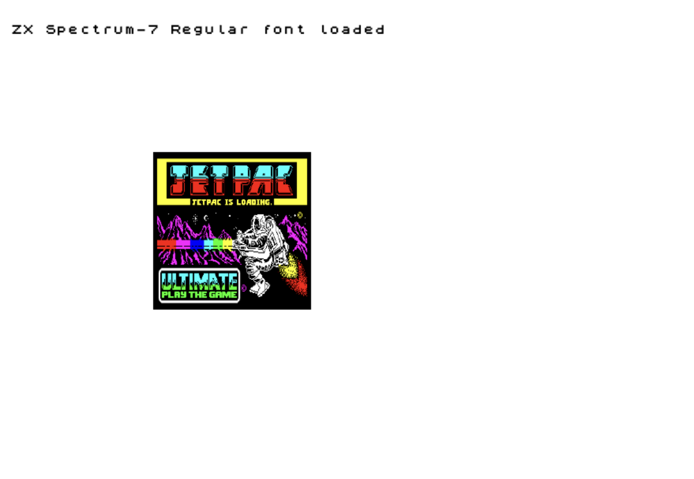
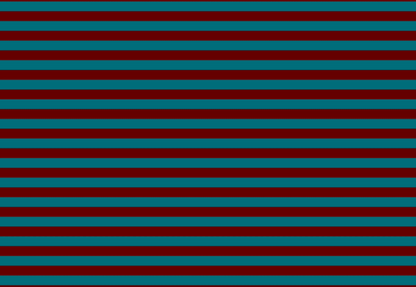
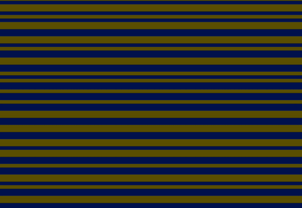
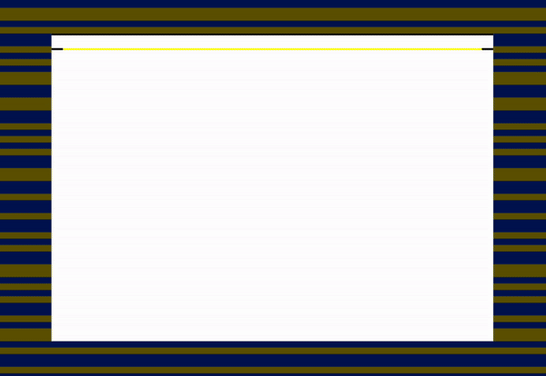
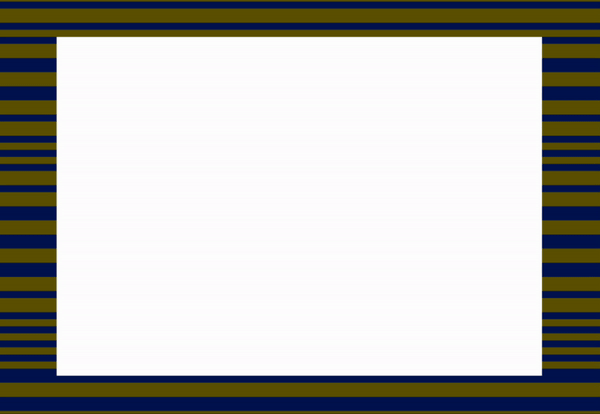
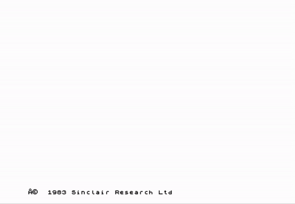

Download font face: https://font.download/font/zx-spectrum-7 by Flavie Hammes

info about the loading cycles: https://shred.zone/cilla/page/440/r-tape-loading-error.html

#### Step 0: Preload Font and Image

#### Step 1: Lead Signal animation

#### Step 2: Sync Signal animation

#### Step 3: Bitstream Signal animation

#### Step 4: Initial Text animation (simulation of writing the prompt command)

#### Step 5: Game image loading animation

#### Step 6: Render white game area during signal animations

#### Final: Entire simulation assembled
